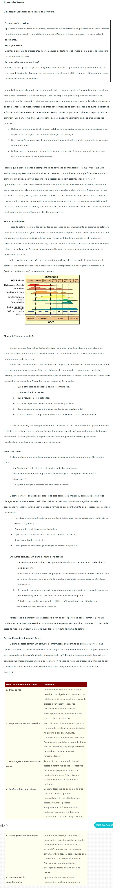

# O QUE É PLANEJAMENTO DE TESTES

O planejamento de testes é uma etapa muito importante para todo processo de testes, é nele que realizamos o planejamento e deixamos claro para todo time as estratégias que serão seguidas durante a modelagem e execução dos testes. Nossos testes terão um foco na camada de front-end? Ou será back-end? 

Será seguida a estratégia de pirâmide de testes? 

Precisaremos de algum tipo de mock para representar serviços que ainda não estão implementados ou dependências externas?

Como nossos testes serão distribuídos nas diferentes camadas do software? 

Que tipo de testes serão aplicados?

Quais serão os cenários mais importantes?

Quais serão os cenários candidatos à automação?

Tudo isto e muito mais precisa ser levado em consideração!

# PLANO DE TESTES - POR DEVMEDIA

# A IMPORTÂNCIA DO PLANO DE TESTE DE SOFTWARE

## O PROCESSO DE TESTE

O processo de teste pode ser dividido em 7 etapas, que chamaremos de 7 atividades do processo de teste.

### AS 7 ATIVIDADES DO PROCESSO DE TESTE:

- **1 Planejamento do teste**

- **2 Monitoramento e controle do teste**

- **3 Análise do teste**

- **4 Modelagem do teste**

- **5 Implementação do teste**

- **6 Execução do teste**

- **7 Conclusão do teste**

### TRANSFORMANDO O PROCESSO DE TESTE EM UM *PLANO DE TESTE*

Na prática o processo de teste precisa ser transformado em algo mais palpável e concreto, algo que possa ser distribuído e que permita que todos os envolvidos no teste saibam o que vai ser testado, como vai ser testado, dentre outras coisas.

Por isso, o processo de testes transforma-se em um documento chamado de *PLANO DE TESTE*, para que o documento possa explicitar algumas das atividades do processo de teste.

Normalmente, quando estamos desenvolvendo um software, vão existir vários planos de teste sendo que podem haver planos de teste separados para cada nível de teste ou, ainda, podem haver planos de testes específicos para cada tipo de teste,por exemplo: plano de testes de usabilidade, plano de testes de performance, plano de testes funcionais, etc.

Então, o plano de teste identifica: as funcionalidades a serem testadas, o objetivo do teste, datas, pessoas envolvidas, os riscos que podem ocorrer dentro dos testes, etc.

*Por que criar um plano de teste?* O plano de teste é um documento que ajuda a determinar o esforço necessário para validar a qualidade do aplicativo em teste e orientar as ações das pessoas envolvidas no teste, como se ele funcionasse como um livro de regras que precisa ser seguido. Por isso é tão importante. 

### SUGESTÃO DE CONTEÚDO DE UM PLANO DE TESTE:

Esses tópicos servem como uma sugestão de organização de conteúdo de um plano de testes, não são necessariamente obrigatórios em um plano de testes, você precisa entender o projeto em que você trabalhará para saber o conteúdo que você considerará importante constar no seu plano de teste.

- 1 Nome do plano de testes

- 2 Resumo do plano de testes, ou seja, dos testes a serem feitos

- 3 Pessoas envolvidas

- 4 Funcionalidades ou Módulos a serem testados (nível/tipo)

- 5 Local dos testes

- 6 Recursos necessários para realização dos testes (software, rede, sala, verba,...)

- 7 Critérios  usados

- 8 Riscos

- 9 Cronograma

- 10 Como os resultados do teste serão divulgados

***SEGUE ABAIXO UM TEMPLATE DE SUGESTÃO DE UM DOCUMENTO DE PLANO DE TESTES***
