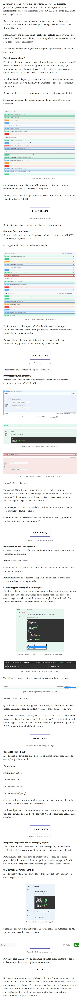

# COBERTURA DE TESTES DE APIs

Um ponto importante que nós, enquanto QAs, precisamos prestar muita atenção é no levantamento de dados e métricas para avaliar e informar o time acerca da saúde do sistema baseado em fatos. Imagine o seu grau de maturidade a poder informar para o PO e demais colegas a porcentagem de cobertura dos testes, porcentagem relativa da cobertura de automação e a porcentagem sobre o que foi priorizado!

Não deixe esse conhecimento passar batido e conquiste um desempenho ainda melhor nos projetos em que atuar!

​​​​​​​*Sim, estamos novamente falando de geração de valor no projeto. Percebe como tudo se encaixa e se reforça?*

## COMO VERIFICAR A COBERTURA DE TESTES DE APIs REST

