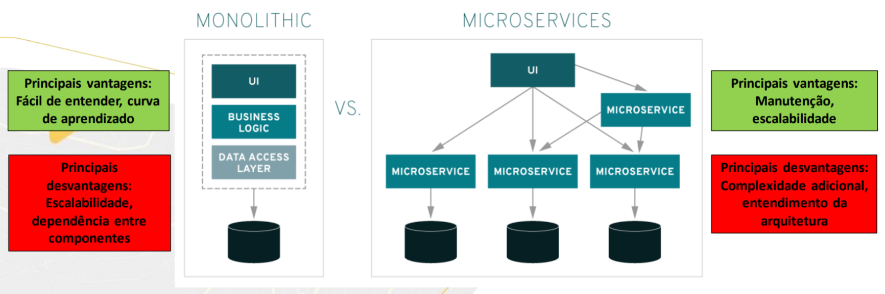

Imagine que você quer criar um aplicação, por exemplo, de uma bliblioteca.

Então você tem um sistema todo por trás muito complexo, isso pode incluir banco de dados, regras de negócio, etc. E você tem um usuário que irá usar essa bliblioteca online através de uma interface web, por exemplo.

Aí que a API entra, você não precisa ter todo o trabalho de fazer todo o código do zero, então você pode usar uma API para a bliblioteca.

Então, quando a gente pensa em API a gente pensa em algo que está sendo consumido pela aplicação. A API ela não tem um rosto, o rosto é a aplicação, a interface gráfica, o que chamamos de front-end.

A aplicação conversa com a API enviando uma REQUISIÇÃO, nessa requisição a gente tem o MÉTODO, a URL, o CABEÇALHO e o CORPO.

A URL É O CAMINHO DO RECURSO DA API QUE A GENTE QUER ACESSAR.

NO CABEÇALHO NÓS TEMOS A INFORMAÇÃO, POR EXEMPLO, DO TOKEN, QUE É O QUE REPRESENTA A AUTENTICAÇÃO DO USUÁRIO.

NÓS TAMBÉM TEMOS O CORPO, ELE VAI TER O OBJETIVO DE VOCÊ USAR ELE PARA ADICIONAR, DENTRO DE DETERMINADO RECURSO, UMA INFORMAÇÃO. ALGUMAS REQUISIÇÕES NÃO PRECISAM DO CORPO.

Então, quando você envia essas informações para uma API, ela vai processar essas informações e irá te retornar com uma resposta e essa resposta poderá ter o formato .xml ou .json.

Antes de aprender a fazer uma requisição, precisamos aprender sobre endpoints.

ENDPOINTS são recursos que a minha API irá ter, para que você possa acessar esses recursos.

Então, na url da API nós damos um get para obtermos uma resposta que virá em formato parecido com uma requisição, mas, somente com cabeçalho e corpo.

ESTE É UM CONCEITO BÁSICO DE UM TESTE DE API.

## MICROSSERVIÇOS vs MONOLITO

As principais diferenças entre os dois e qual seria considerado melhor para cada projeto

### MONOLITHIC

**PRINCIPAIS VANTAGENS:**

Fácil de entender, curva de aprendizado.

**PRINCIPAIS DESVANTAGENS:**

Escalabilidade, dependência entre componentes.