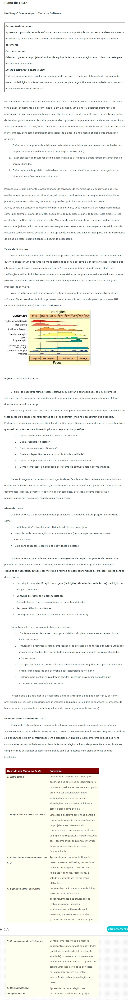

# O QUE É PLANEJAMENTO DE TESTES

O planejamento de testes é uma etapa muito importante para todo processo de testes, é nele que realizamos o planejamento e deixamos claro para todo time as estratégias que serão seguidas durante a modelagem e execução dos testes. Nossos testes terão um foco na camada de front-end? Ou será back-end? 

Será seguida a estratégia de pirâmide de testes? 

Precisaremos de algum tipo de mock para representar serviços que ainda não estão implementados ou dependências externas?

Como nossos testes serão distribuídos nas diferentes camadas do software? 

Que tipo de testes serão aplicados?

Quais serão os cenários mais importantes?

Quais serão os cenários candidatos à automação?

Tudo isto e muito mais precisa ser levado em consideração!

# PLANO DE TESTES - POR DEVMEDIA

# A IMPORTÂNCIA DO PLANO DE TESTE DE SOFTWARE

### O PROCESSO DE TESTE
