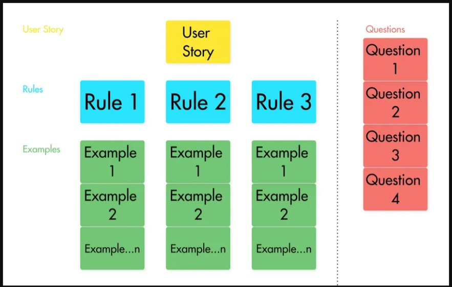
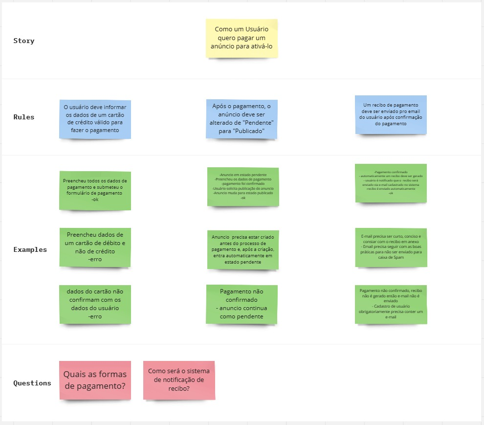

# USER STORIES A SERVIR COMO REQUISITO PARA O PLANEJAMENTO DE TESTES A SER FEITO:

## [API] Usuários

Sendo um vendedor de uma loja, gostaria de poder me cadastrar no Marketplace do ServeRest para poder realizar as vendas dos meus produtos

**DoR**

- Banco de Dados e infraestrutura para desenvolvimento disponibilizados.
- Ambiente de testes disponibilizado.

**DoD**

- CRUD de cadastro de vendedores (usuários) implementado (CRIAR, ATUALIZAR, LISTAR E DELETAR).
- Análise de testes cobrindo todos verbos.
- Matriz de rastreabilidade atualizada.
- Automação de testes baseado na análise realizada.

**Acceptance Criteria**

- Os vendedores (usuários) deverão possuir os campos NOME, E-MAIL, PASSWORD e ADMINISTRADOR.
- Não deverá ser possível fazer ações e chamadas para usuários inexistentes.
- Não deve ser possível criar um usuário com e-mail já utilizado.
- Caso não seja encontrado usuário com o ID informado no PUT, um novo usuário deverá ser criado.
- Não deve ser possível cadastrar usuário com e-mail já utilizado utilizando PUT.
- Os testes executados deverão conter evidências.
- Não deverá ser possível cadastrar usuários com e-mails de provedor gmail e hotmail.
- Os e-mails devem seguir um padrão válido de e-mail para o cadastro;
- As senhas devem possuír no mínimo 5 caracteres e no máximo 10 caracteres.
- A cobertura de testes deve se basear no Swagger e ir além, cobrindo cenários alternativos.

# COMO ESPECIFICAR REQUISITOS EM PROJETOS DE SOFTWARE UTILIZANDO USER STORIES (COMO MONTAR HISTÓRIAS DE USUÁRIO)

## O QUE SÃO USER STORIES

User stories (histórias de usuários) nada mais é do que uma descrição resumida da feature que você vai implementar para o seu cliente.

Cada história de usuário precisa se *independente, mensurável e testável*

## Example Mapping

O Example Mapping é uma técnica que utilizamos para identificar as coisas que estão ocultas na história do usuário e que vão nos ajudar a mensurar a história e saber quais são os passos que devem ser implementados para que aquela história seja atendida.

Pra isso nós utilizamos o conceito dos 3 amigos, que representam os 3 aspectos diferentes na hora que você está desenvolvendo o sistema, são eles: O cliente, A visão do desenvolvedor e A visão do testador. 

Você não precisa ser ortodoxo e seguir exatamente esse mapping,mas é preciso entender que existem esses 3 papéis principais dentro de um User Story.

O Example Mapping de um User Story é dividido em:
- Histórias de Usuário
- Regras da história (critérios)
- Exemplos da regra
- Questões Levantadas

***UM ESQUELETO DE UM EXAMPLE MAPPING DEVERÁ SEGUIR ESTE ESTILO:***

## EXERCÍCIO UDEMY DE EXAMPLE MAPPING DESENVOLVIDO EM MIRO:

